# Holbegram

## Description

This project is a mobile social media application inspired by Instagram, developed with Flutter as part of the Holberton School curriculum.

The app allows users to sign up, log in, upload images, create posts, like and save content, search posts, and manage their profile using a modern and responsive UI.

## Objectives

At the end of this project, I should be able to explain to anyone, **without the help of Google**:

- How to build reusable widgets in Flutter.
- How authentication works with Firebase.
- How to store and retrieve data using Cloud Firestore.
- How to upload and manage images with Cloudinary.
- How to pass data between screens.
- How to manage application state with Provider.
- How to structure a scalable Flutter project.
- How to implement navigation and bottom navigation bars.
- How to build responsive and user-friendly UI components.

## Requirements

- Build a complete mobile application using Flutter.
- Implement user authentication (sign up, log in, log out).
- Use Firebase Authentication and Cloud Firestore for data management.
- Store and retrieve images using a remote image hosting service.
- Create reusable widgets and respect Flutter best practices.
- Respect the required project structure and file organization.
- Ensure navigation between all pages works correctly.
- Handle state management properly.
- The application must run without errors on emulator or physical device.

## Instructions

### Mandatory

<details>
	<summary>
		<b>0. Let’s Begin</b>
	</summary>
	<br>

Now after we set our Firebase we gonna start build our Application, First we are going to create Three screens `Login`page, `Sign up`page and `Upload image` page.


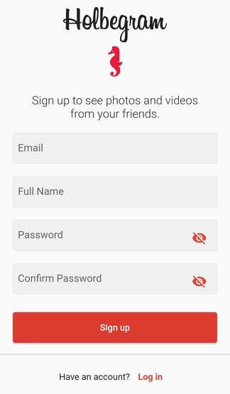

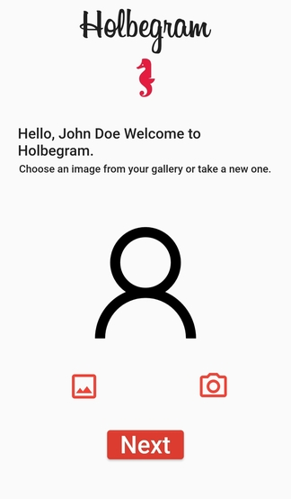

**In your `lib` folder:**

- Create new folder named `screens`:
	- Inside the `screens` folder create 3 files named:
		- `login_screen.dart`.
		- `signup_screen.dart`.
		- `upload_image_screen.dart`.

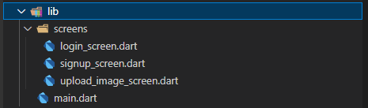

- Create new folder named `widgets`:
	- Inside the `widgets` folder create 1 file named:
		- `text_field.dart`.

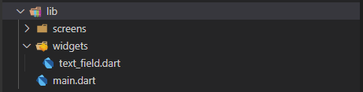

**Initialization App**

Install these packages:

- `firebase_auth`: `flutter pub add firebase_auth`.
- `firebase_database`: `flutter pub add firebase_database`.
- `cloudinary_flutter`: `flutter pub add cloudinary_flutter`.

Change the function `void main()` to:

```
Future main() async {
  WidgetsFlutterBinding.ensureInitialized();
  await Firebase.initializeApp();
  runApp(const MyApp());
}
```

#
**Repo:**
- GitHub repository: `holbertonschool-holbegram`.
- Directory: `holbegram`.
- File: `README.md`, `lib\main.dart`, `lib\screens\login_screen.dart`, `lib\screens\signup_screen.dart`, `lib\screens\upload_image_screen.dart`, `lib\widgets\text_field.dart`.
<hr>
</details>

<details>
	<summary>
		<b>1. Text Widget</b>
	</summary>
	<br>

In the `widgets/text_field.dart`:

In order to learn how a reusable widget works, we will build this TextField widget.

Create a new `StatelessWidget` called `TextFieldInput`with these attributes:

- `controller`: TextEditingController.
- `ispassword`: bool.
- `hintText`: String.
- `suffixIcon`: Widget it cloud be `null`.
- `keyboardType`: TextInputType.

After the `Widget build`.

Return `TextField()`:

- `keyboardType` takes `keyboardType`.
- `controller` takes `controller`.
- `cursorColor` takes `Color.fromARGB(218, 226, 37, 24)`.
- `decoration` takes `InputDecoration`:
	- `hintText` takes `hintText`.
	- `border` takes `OutlineInputBorder`:
		- `borderSide`: `BorderSide`:
			- `color` : `transparent`.
			- `style`: `none`
	- `focusedBorder`: `OutlineInputBorder`:
		- `border` takes `OutlineInputBorder`:
			- `borderSide`: `BorderSide`:
				- `color`: `transparent`.
				- `style`: `none`.
	- `enabledBorder`: `OutlineInputBorder`:
		- `border` takes `OutlineInputBorder`:
			- `borderSide`: `BorderSide`:
				- `color`: `transparent`.
				- `style`: `none`.
	- `filled` : `true`.
	- `contentPadding` : `EdgeInsets.all(8)`.
	- `suffixIcon` takes `suffixIcon`.
- `textInputAction` : `next`.
- `obscureText` takes `ispassword`.

For Example :

If we put the `hintText`: `Email` it’s giong to be like this:

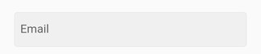

Another Example :

If we put the `hintText`: `Password` and `ispassword`: `true`, it’s giong to be like this:

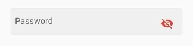

#
**Repo:**
- GitHub repository: `holbertonschool-holbegram`.
- Directory: `holbegram`.
- File: `file_name`.
<hr>
</details>

<details>
	<summary>
		<b>2. Login Page</b>
	</summary>
	<br>

Login Page

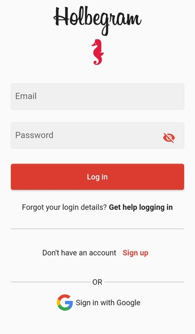

You will need this [Logo](https://raw.githubusercontent.com/usfbelhadj/Holbegram_asset/main/logo.webp) and this [Font](https://fontsfree.net/billabong-font-download.html).

After That Create two folders inside the `assets` :

- `images`.
- `fonts`.

Put the `Logo` inside the `images` folder and `Billabong` fonts inside the `fonts` folder.

Inside the `pubspec.yaml`:

- Add this `- assets/images/` under the `assets`:

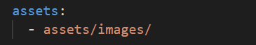

- Add this under the fonts:

```
- family: Billabong
  fonts:
	- asset: assets/fonts/Billabong.ttf
    - asset: assets/fonts/InstagramSans.ttf
```

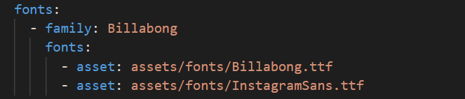

**Now**

Inside `login_screen.dart`:

- Create a new `StatefulWidget` called `LoginScreen` that takes these arguments:

	- `emailController`: `TextEditingController`.
	- `passwordController`: `TextEditingController`.
	- `_passwordVisible`: `bool` default takes `true`.

**Dispose** only the `TextEditingController` arguments.

**initState** for the `_passwordVisible`, before that, you add `@override` annotation:

- Returns: `Scaffold()` Inside the scaffold add a `SingleChildScrollView` in the body:
	- `SingleChildScrollView` takes `Column`:
		- `Horizontally` of the `Column` will be : `min`.
		- `Verticale` of the `Column` will be : `center`.
	- Inside of the `Column`:
		- `children[]`:
			- Set the `SizedBox` of `height` to `28`.
			- Create a Text widget that contains the name of the app `Holbegram` with the `Billabong` Font and the font size of `50`.
			- The logo will be inside an Image widget (`width: 80`, `height: 60`).
			- Create `Padding`:
				- Set `EdgeInsets.symmetric` to `horizontal` : `20`.
				- Child takes a `Column`.
				- Inside the `Children` of the `Column` we are going to call the `TextFieldInput` that we created. First let’s keep our screen Sized.
			- `SizedBox` takes height: `28`.
		- Email `TextFieldInput`:

			```
			* `controller` : `emailController`

			* `ispassword` : flase

			* `hintText` : `Email`

			* `keyboardType` : `TextInputType.emailAddress`
			```

	- Set the `SizedBox` of `height` to `24`:
	- Password TextField:
		- `TextFieldInput`:
			- `controller`: `passwordController`.
			- `ispassword`: `!_passwordVisible`.
			- `hintText`: `Password`.
			- `keyboardType`: `TextInputType.visiblePassword`.
			- `suffixIcon` takes `IconButton`.
				- `alignment` : `bottomLeft`.
				- If the `_passwordVisible` is `true`, `icon` takes `visibility` or `icon` takes `visibility_off`.
				- Use setState inside the `onPressed: ()` to change the `_passwordVisible` when pressed.
	- Set the `SizedBox` of `height` to `28`.
	- `SizedBox`:
		- `height`: `48`.
		- `width`: `double.infinity`.
		- `child`: `ElevatedButton`:
			- `style`:
				- `ButtonStyle`:
					- `backgroundColor :WidgetStateProperty.all(Color.fromARGB(218, 226, 37, 24),)`.
				- `onPressed` leave it empty for the moment.
				- `child`: `Text`:
					- `Log in`.
					- `style`:
						- `TextStyle(color: Colors.white)`.
	
	After this:

	- Set the `SizedBox` of height to `24`.
	- `Row`:
		- `mainAxisAlignment`: `center`.
		- `children`:
			- `Text`: `Forgot your login details?`.
			- `Text`: `Get help logging in` with `fontWeight`: `bold`.
	- `Flexible`:
		- `flex`: `0`.
		- `child`: `Container()`.
	- Set the `SizedBox` of `height` to `24`.
	- `Divider` : `thickness` to `2`.
	- `Padding`:
		- Set `vertical` padding to `12`.
	- `child` takes `Row`:
		- `mainAxisAlignment`: `center`.
		- `children`:
			- `Text` : `Don&#39;t have an account`.
			- `TextButton`:
				- `onPressed` leave it empty for the moment.
				- `child` takes `Text` with a String `Sign up` set `fontWeight` to `bold` and `color` to `fromARGB(218, 226, 37, 24)`.
		- Set the `SizedBox` of `height` to `10`.
	- `Row`:
		- `children`:
			Create two `Flexible` widgets with `child` takes `Divider`: `thickness` to `2` between the two widget create a `Text` with string `&quot; OR &quot;`.
	- Set the `SizedBox` of `height` to `10`.
	- `Row`:
		`mainAxisSize`: `min`.
		`mainAxisAlignment`: `center`.
		`children`:
			- Takes an Image network with `width: 40`, `height: 40`.
				- Image : `Image Link`.
			- `Text` : `&quot;Sign in with Google&quot;`.

#
**Repo:**
- GitHub repository: `holbertonschool-holbegram`.
- Directory: `holbegram`.
- File: `lib\screens\login_screen.dart`.
<hr>
</details>

<details>
	<summary>
		<b>3. Signup Page</b>
	</summary>
	<br>

Signup Page


Inside `signup_screen.dart` create :

- Create a new `StatefulWidget` called `SignUp` takes these arguments:
	- `emailController`: `TextEditingController`.
	- `usernameController`: `TextEditingController`.
	- `passwordController`: `TextEditingController`.
	- `passwordConfirmController`: `TextEditingController`.
	- `_passwordVisible`: `bool` default takes `true`.

Let’s `dispose` them like we did in the Login Page and don’t forget `initState` for the `_passwordVisible`.

Now! we are going to do the `Sign Up` page. It is very similar to the previous task therefore, I want you to try this on your own.

If you face any difficulties check the previous task or do as any great developer does: Google it!

In the bottom there is a String "Log in".

It’s a `TextButton` that navigates you to the Log in page.

If you want to do it alone it’s a plus too or jump to the next task.

#
**Repo:**
- GitHub repository: `holbertonschool-holbegram`.
- Directory: `holbegram`.
- File: `lib\screens\signup_screen.dart`.
<hr>
</details>

<details>
	<summary>
		<b>4. Linking the Pages</b>
	</summary>
	<br>

Inside `login_screen.dart`.
In the `TextButton` widget that contains `Sign Up` as a `Text`:

- We will change the `onPressed` to make it navigate to the Sign Up page:
	- Use `Navigator.push`:
		- Assign `SignUp()` and don’t forget to import it.

Inside `signup_screen.dart`.
In the `TextButton` widget that contain `Log in` as a `Text`:

- We will change the `onPressed` to make it navigate to the Log in page:
	- Use `Navigator.push`:
		- Assign `LoginScreen()` and don’t forget to import it.

#
**Repo:**
- GitHub repository: `holbertonschool-holbegram`.
- Directory: `holbegram`.
- File: `lib\screens\login_screen.dart`, `lib\screens\signup_screen.dart`.
<hr>
</details>

<details>
	<summary>
		<b>5. Let's Create Our Models</b>
	</summary>
	<br>

In the `lib` folder:

- Create a new folder called `models` that contains two file :
	- `user.dart`.
	- `posts.dart`.

In the `lib/models/user.dart` create a class called `Users`:

- Properties:

	- `uid`: String.
	- `email`: String.
	- `username`: String.
	- `bio`: String.
	- `photoUrl`: String.
	- `followers`: List`&lt;dynamic&gt;`.
	- `following`: List`&lt;dynamic&gt;`.
	- `posts`: List`&lt;dynamic&gt;`.
	- `saved`: List`&lt;dynamic&gt;`.
	- `searchKey`: String.

Create a new Method called `fromSnap` that accepts `DocumentSnapshot` as parameter:
	- Prototype :
		- `static Userd fromSnap(DocumentSnapshot snap)`.

Create a variable inside the `fromJson` called `snapshot` that is going to take the data from `snap`.

Return every value inside it.

Create a method called `toJson()` that returns a map representation of the `Users`.

#
**Repo:**
- GitHub repository: `holbertonschool-holbegram`.
- Directory: `holbegram`.
- File: `lib/models/user.dart`, `lib/models/posts.dart`.
<hr>
</details>

<details>
	<summary>
		<b>6. Auth Methods</b>
	</summary>
	<br>

Create a new folder inside the `lib` called `methods`.

Inside `lib/methods` create a new file called `auth_methods.dart`.

Now inside `auth_methods.dart`:

- Start by adding the packages needed :
	- `Cloud_firestore`.
	- `Firebase_auth`.
	- `http (for Cloudinary API requests)`.
	- Create a new Class called `AuthMethode` that’s going to contain our Methods.

Inside the class, create two arguments:
	- `_auth` that extends from `FirebaseAuth`.
	- `_firestore` that extends from `FirebaseFirestore`.

- `_auth` = `FirebaseAuth.instance`.

- `_firestore` = `FirebaseFirestore.instance`.

Create a new instance for `Login` called login that takes two arguments `email`: String, `password`: String. Return a String

- Prototype :
	- `Future&lt;String&gt; login({required String email,required String password,})`:
		- Check if the email or the password are empty:
			- Return `Please fill all the fields`.
		- Use `_auth.signInWithEmailAndPassword` method from `FirebaseAuth`.
		- Return `success`:
			- On success navigate to the home screen.

Now go back to the login screen and edit the submit button to call `login()` while passing the corresponding parameters and use the function’s return value to show a snackbar with the text "Login" on success.

Create a new instance for Sign Up called `signUpUser` that takes these arguments `email`: String , `password`: String , `username`: String , `file`: Uint8List. Return a String

- Prototype :
	- `Future&lt;String&gt; signUpUser({required String email,required String password,required String username,Uint8List? file,})`.
		- Check if the `email` or the `password`, `username` are empty:
			- Return `Please fill all the fields`.
		- Use `_auth.createUserWithEmailAndPassword` method from `FirebaseAuth`.
		- `userCredential` takes the return of the `_auth.createUserWithEmailAndPassword`.

**Now** right! after using `_auth.createUserWithEmailAndPassword` put this:
- `User` takes `userCredential.user;`.

The arguments that we just passed in to Sign Up put it to our `Users` Class.

After that:
- `await _firestore.collection(&quot;users&quot;).doc(user.uid).set(users.toJson());`.
- Return `success`.

#
**Repo:**
- GitHub repository: `holbertonschool-holbegram`.
- Directory: `holbegram`.
- File: `lib/methods/auth_methods.dart`.
<hr>
</details>

<details>
	<summary>
		<b>7. Upload User Image</b>
	</summary>
	<br>

Let’s put our file in the `screens` inside a new folder called auth :

- Create a new folder inside `screens/auth` called `methods`:

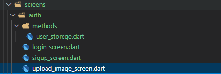

- Inside `methods` folder create a new file called `user_storage.dart`:

Copy and paste the Code into your file:

```
import 'dart:typed_data';
import 'package:uuid/uuid.dart';
import 'package:http/http.dart' as http;
import 'dart:convert';

class StorageMethods {
  final String cloudinaryUrl = "https://api.cloudinary.com/v1_1/your-cloud-name/image/upload";
  final String cloudinaryPreset = "your-upload-preset";

  Future uploadImageToStorage(
      bool isPost,
      String childName,
      Uint8List file,
  ) async {
    String uniqueId = const Uuid().v1();
    var uri = Uri.parse(cloudinaryUrl);
    var request = http.MultipartRequest('POST', uri);
    request.fields['upload_preset'] = cloudinaryPreset;
    request.fields['folder'] = childName;
    request.fields['public_id'] = isPost ? uniqueId : '';

    var multipartFile = http.MultipartFile.fromBytes('file', file, filename: '$uniqueId.jpg');
    request.files.add(multipartFile);

    var response = await request.send();
    if (response.statusCode == 200) {
      var responseData = await response.stream.toBytes();
      var jsonResponse = jsonDecode(String.fromCharCodes(responseData));
      return jsonResponse['secure_url'];
    } else {
      throw Exception('Failed to upload image to Cloudinary');
    }
  }
}
```

- Inside the `upload_image_screen.dart`:
	- Create a `StatefulWidget` Called `AddPicture` that accepts three arguments :
		- `final String email`.
		- `final String password`.
		- `final String username`.

- And contains a variable called `_image`:
	- Uint8List? _image

- Create two methods:
	- The first one is Called `selectImageFromGallery()`:
		- Prototype:
			- `void selectImageFromGallery()`.
			- Return the value to variable `_image`.
		- Use `imagepicker`.

	- The second one is called `selectImageFromCamera()`:
		- Prototype:
			- `void selectImageFromCamera()`.
			- Return the value to variable `_image`.
		- Use `imagepicker`.

**Now**

Let’s Create this UI:
- The [Link To the Icon](https://upload.wikimedia.org/wikipedia/commons/9/99/Sample_User_Icon.png).


Make the camera icon and the gallery icon linking with these functions

Replace the user icon with your image:

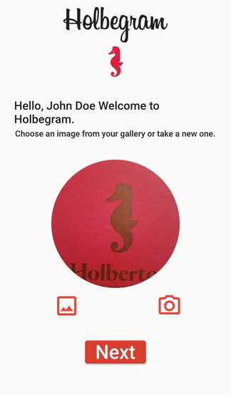

#
**Repo:**
- GitHub repository: `holbertonschool-holbegram`.
- Directory: `holbegram`.
- File: `lib\screens\auth\methods\user_storage.dart`, `lib\screens\upload_image_screen.dart`.
<hr>
</details>

<details>
	<summary>
		<b>8. Passing Data Between Pages</b>
	</summary>
	<br>

We are going to pass the sign up data to our upload picture page.

Inside `signup_screen.dart`:

- In the `onPressed` where the Text contain `Sign up`, use the `Navigator` to move to the `AddPicture` page and passing :
	- `email`.
	- `username`.
	- `password`.

Inside `upload_image_screen.dart`:

**Use widget when you want to call the data example:**

- `widget.email` or assign it to a variable `var email = widget.email`.
- Replace `John Doe` with the `username`.
- On the Next button call the method `signUpUser` that we created in the `auth_methods.dart`.
- Passing the correct data to the `signUpUser`:
	- `email` takes `email`.
	- `username` takes `username`.
	- `password` takes `password`.
	- `file` takes `_image`.
	- On `success` show a `snackbar` with a `success` on it.

#
**Repo:**
- GitHub repository: `holbertonschool-holbegram`.
- Directory: `holbegram`.
- File: `lib\screens\signup_screen.dart`, `lib\screens\upload_image_screen.dart`.
<hr>
</details>

<details>
	<summary>
		<b>9. Providers</b>
	</summary>
	<br>

Create a new method called `getUserDetails` inside `auth_methods.dart` that gets the current user details and return `Userd.fromSnap` within the details

Inside the `lib/` create a new folder called `providers` that contain `user_provider.dart` file:

- Inside `user_provider.dart` Create a class called `UserProvider` mixin with the `ChangeNotifier`.
- Create privet variables:
	- `_user` takes `Userd`.
	- `_authMethode` takes `AuthMethode()`.
- Create a getter for `_user`.
- Create a method called `refreshUser` prototype:
	- Future `refreshUser()`:
		- `user` takes `getUserDetails` method from `AuthMethode()`.
		- `_userd` takes `user`.
		- At the end add `notifyListeners()`.

#
**Repo:**
- GitHub repository: `holbertonschool-holbegram`.
- Directory: `holbegram`.
- File: `lib\methods\auth_methods.dart`, `lib\providers`.
<hr>
</details>

<details>
	<summary>
		<b>10. Home Page</b>
	</summary>
	<br>

We are going to create the Home page now :

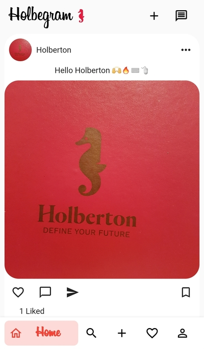

**First** we are going to create all pages:

- Create a new folder inside the screens folder called `pages`:
	- `Feed()`: `feed.dart`
	- `Search()`: `search.dart`
	- `AddImage()`: `add_image.dart`
	- `Favorite()`: `favorite.dart`
	- `Profile()`: `profile_screen.dart`

To start with the bottom navigation bar, install this package:

- [BottomNavyBar](https://pub.dev/packages/bottom_navy_bar).

Inside the `widgets` folder:

- Create a new file called `bottom_nav.dart`:
	- Create a `StatefulWidget` called BottomNav.
	- `_currentIndex`: `0`.
	- `_pageController` assign to `PageController`.
	- `initState()`:
		- `_pageController` : `PageController()`.
	- `dispose()`.
	- Return `Scaffold` body `PageView`.
		- `controller`: `_pageController`.
	- `children` takes all the pages:
		- `Feed()`.
		- `Search()`.
		- `AddImage()`.
		- `Favorite()`.
		- `Profile()`.
	- `bottomNavigationBar`: `BottomNavyBar`:
		- `selectedIndex`: `_currentIndex`.
		- `showElevation`: `true`.
		- `itemCornerRadius`: `8`.
		- `curve`: `Curves.easeInBack`.
		- `onItemSelected`: `onPageChanged` takes an arguments called index:
			- In `setState` `_currentIndex` takes `index`.

	- `items` it’s a list of `BottomNavyBarItem` we are going to create Five of them and every each one has a different `Icon`, `Text`:
		- Inside `BottomNavyBarItem`:
		- `icon`: `Icons`.
		- `title`: `Text`.
			- `TextStyle`:
				- `fontSize`: `25`.
				- `fontFamily`: `Billabong`.
			- `activeColor`: `red`.
			- `textAlign`: `center`.
			- `inactiveColor`: `black`.

**Now**

Inside `home.dart`:

- Create `StatefulWidget` called `Home` that returns `BottomNav()`.

Inside `feed.dart`:

- Create `StatelessWidget` called `Feed` that returns `Scaffold()`:
	- With an `AppBar` contains `Holbegram` with `Billabong` font and the logo like in the Picture and a `Row` with two Icons.
	- Body return widget called `Posts()` that we are going to create later.

In the `models/post.dart`:

- Create a class called `Post`:
	- `caption`: `String`.
	- `uid`: `String`.
	- `username`: `String`.
	- `likes`: `List`.
	- `postId`: `String`.
	- `datePublished`: `DateTime`.
	- `postUrl`: `String`.
	- `profImage`: `String`.

Create the instance `fromSnap` like we did in the Users Class.

Don’t forget the `toJson` method.

Inside `utils/posts.dart`:

- Create a `StatefulWidget` called `Posts` using the `getUser`.

**Use the provider and make necessary changes if required**.

- Return `StreamBuilder` :
	- `stream`: `FirebaseFirestore.instance.collection(&#39;posts&#39;).snapshots()`.
	- If `snapshot.hasError` return `Error {snapshot.error}`.
	- If `snapshot.hasData` return `ListView.builder`.
	- `data` = `snapshot.data.docs`.

		- Return `SingleChildScrollView`.
		- `Child`: `Container`:
			- `margin`: `EdgeInsetsGeometry.lerp(const EdgeInsets.all(8), const EdgeInsets.all(8), 10)`.
			- `height`: `540`.
			- `decoration`: `color fromARGB(255, 255, 255, 255), borderRadius circular(25)`.
		- `Child` : `column` > `children` > `container` > `child` > `row` > `children`:
			- `padding EdgeInsets.all(8.0)` > `child` > `container width: 40, height: 40` > `decoration BoxDecoration(shape: BoxShape.circle)` > `image` > `data[&#39;profImage&#39;] fit : cover`.
			- `Text`: `username`.
			- `Spacer`.
			- `IconButton`:
				- `Icon`: `more_horiz`.
				- `onPressed`: show snack with `Text` “Post Deleted”.
			- `SizedBox`:
				- `child`: `Text` that contain the `caption`.
			- `SizedBox`:
				- `height`: `10`.
			- `Container`:
				- `width`: `350`.
				- `height`: `350`.
				- `decoration`: `BorderRadius.circular 25`.
				- `image`: `postUrl`.
				- `fit`: `cover`.

Add the missing `Icons` that appears in the `Picture`.

Return `CircularProgressIndicator()` if the data still fetching.

#
**Repo:**
- GitHub repository: `holbertonschool-holbegram`.
- Directory: `holbegram`.
- File: `lib\screens\home.dart`, `lib\screens\pages\feed.dart`, `lib\screens\pages\search.dart`, `lib\screens\pages\add_image.dart`, `lib\screens\pages\favorate.dart`, `lib\screens\pages\profile_screen.dart`, `models/post.dart`, `utils/posts.dart`.
<hr>
</details>

<details>
	<summary>
		<b>11. Posts Storge Methods</b>
	</summary>
	<br>

Inside the `pages` folder create a new folder called `methods`:

Inside the `methods` create a new file called `post_storage.dart`:

- Create a class called `PostStorage`:
	- `_firestore` takes : `FirebaseFirestore.instance`.

**Methods**

Create a method Called `uploadPost` takes `caption`, `uid`, `username`, `profImage` as a `String` and `image` as `Uint8List`:

- Method prototype : `Future&lt;String&gt; uploadPost(String caption,String uid,String username,String profImage,Uint8List image)`.

Should use `uploadImageToCloudinary` from `lib\screens\auth\methods\user_storege.dart`.

Return "`Ok`" On success else Return the error.

Create another method called `deletePost` that accept `postId` and `publicId` as an arguments to delete the post:

- Method prototype : `Future&lt;void&gt; deletePost(String postId, string publicId)`.

Inside `utils/posts.dart`:

- In the `onPressed()` Before the `snackbar` that shows “Post Deleted” Call the the `deletePost` it should delete your post when you pressed on the icon.

#
**Repo:**
- GitHub repository: `holbertonschool-holbegram`.
- Directory: `holbegram`.
<hr>
</details>

<details>
	<summary>
		<b>12. Add a post</b>
	</summary>
	<br>

Inside `add_image.dart` we are going to create this UI:

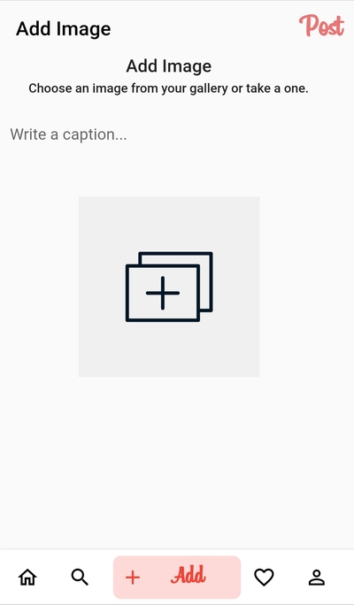

[Link to the Icon](https://cdn.pixabay.com/photo/2017/11/10/05/24/add-2935429_960_720.png).

**Make necessary changes if required.**

Like we did in the `AddPicture`:
- Use `image_picker`:
	- Using the two option to add an image [`gallery`, `camera`].

Call `uploadPost` when you press on `Post` and make sure to redirect to the `Home page`.

#
**Repo:**
- GitHub repository: `holbertonschool-holbegram`.
- Directory: `holbegram`.
- File: `lib\screens\pages\add_image.dart`.
<hr>
</details>

<details>
	<summary>
		<b>13. Search page</b>
	</summary>
	<br>

Inside `search.dart` we are going to create this UI:

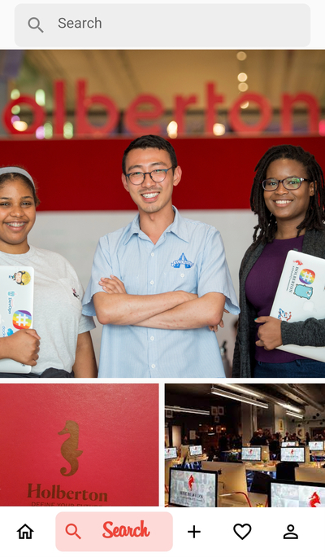

**Make necessary changes if required.**

- Display all images uploaded to `Cloudinary`.
- Use `StaggeredGridView`.

#
**Repo:**
- GitHub repository: `holbertonschool-holbegram`.
- Directory: `holbegram`.
- File: `lib\screens\pages\search.dart`.
<hr>
</details>

<details>
	<summary>
		<b>14. Favorite page</b>
	</summary>
	<br>

Inside `favorite.dart` we are going to create this UI:

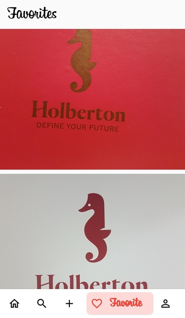

**Make necessary changes if required.**

when clicking on the `Icons.bookmark` in the Feed, the image get saved and it appears in the Favorite page.

#
**Repo:**
- GitHub repository: `holbertonschool-holbegram`.
- Directory: `holbegram`.
- File: `lib\screens\pages\favorite.dart`.
<hr>
</details>

<details>
	<summary>
		<b>15. Profile</b>
	</summary>
	<br>

Inside `profile.dart` we are going to create this UI:

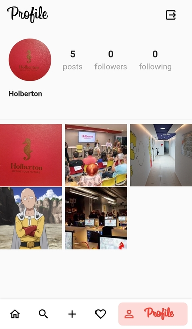

The icon at the top is for Logout.

**Make necessary changes if required.**

Retrieve and display the necessary data, including images stored on Cloudinary.

And **congratulations** you made it!

#
**Repo:**
- GitHub repository: `holbertonschool-holbegram`.
- Directory: `holbegram`.
- File: `lib\screens\pages\profile_screen.dart`.
<hr>
</details>

## Tech Stack


## File Description

| **FILE**                | **DESCRIPTION**                                     |
| :---------------------: | --------------------------------------------------- |
| `assets`                | Contains the resources required for the repository. |
| `android`               | Android platform configuration and native code.     |
| `ios`                   | iOS platform configuration and native code.         |
| `linux`                 | Linux desktop platform configuration.               |
| `macos`                 | macOS desktop platform configuration.               |
| `web`                   | Web platform configuration and entry point.         |
| `windows`               | Windows desktop platform configuration.             |
| `lib`                   | Main application source code.                       |
| `test`                  | Application tests.                                  |
| `metadata`              | Flutter project metadata.                           |
| `firebase.json`         | Firebase project configuration.                     |
| `analysis_options.yaml` | Dart linting and analysis rules.                    |
| `pubspec.yaml`          | Project dependencies and assets configuration.      |
| `pubspec.lock`          | Locked dependency versions.                         |
| `.gitignore`            | Specifies files and folders to be ignored by Git.   |
| `README.md`             | The README file you are currently reading 😉.       |

## Installation & Usage

### Installation

A release APK is provided to allow quick testing of the application without setting up Flutter or Firebase locally.

1. Download the APK from the repository:
   - Go to the "Releases" section on GitHub.
   - Download [holbegram.apk](https://github.com/fchavonet/holbertonschool-holbegram/releases/download/v1.0-beta/holbegram.apk).

2. Transfer the APK to an Android device.

3. Enable installation from unknown sources on the device.

4. Install and launch the application.

> This option is intended for demonstration and testing purposes only.

### Usage

1. Create an account.

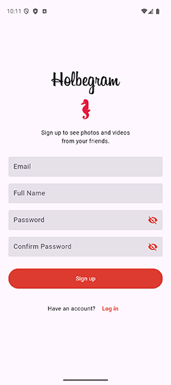

2. Upload or choose a profile picture.

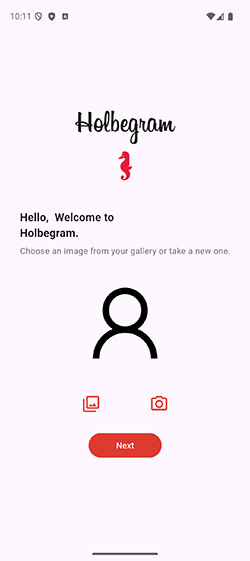

3. Log in.

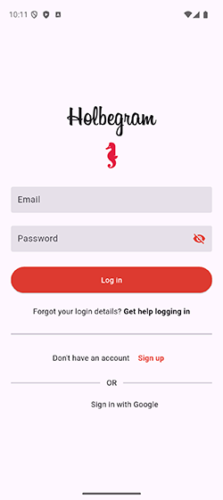

4. Create and publish posts.

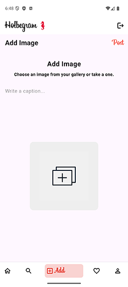
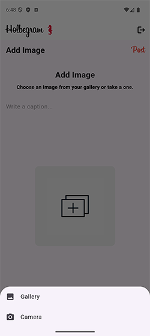

5. Like and save posts.

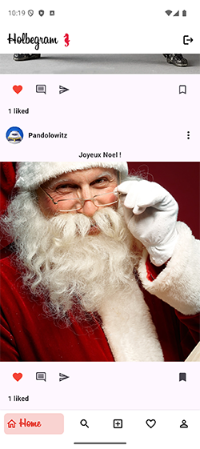

6. Search for posts.

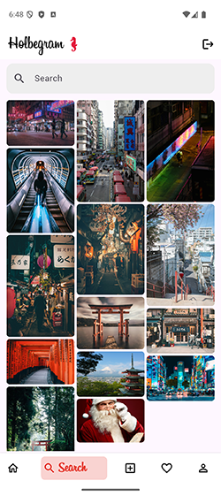

7. View your favorites.

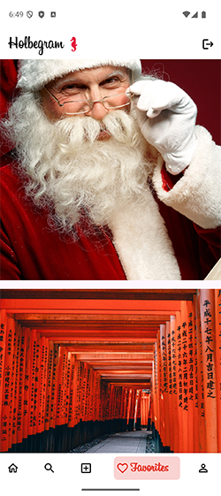

8. View and manage your profile.

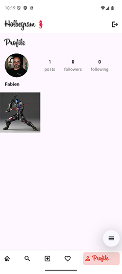

## What's Next?

- Add comments on posts.
- Add real-time notifications.
- Improve search performance.
- Refactor code for scalability.

## Thanks

- A big thank you to all my Holberton School peers for their help and support throughout this project.

## Author(s)

**Fabien CHAVONET**
- GitHub: [@fchavonet](https://github.com/fchavonet)
